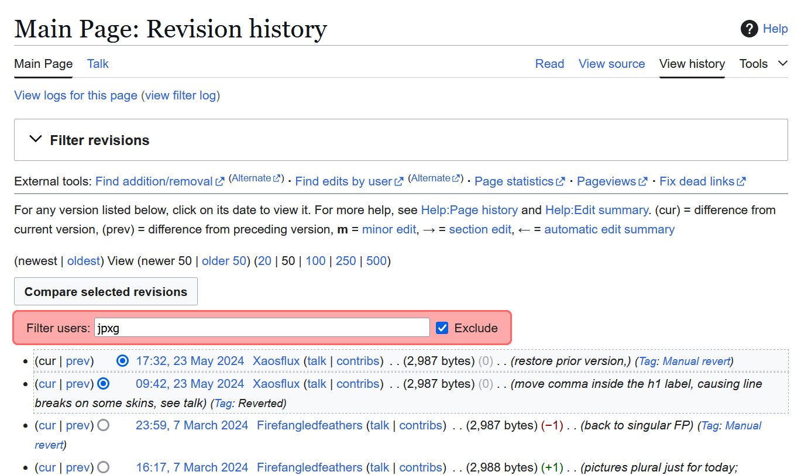

# Wikipedia user scripts by Hex

**[User scripts](https://en.wikipedia.org/wiki/Wikipedia:User_scripts)** on [Wikipedia](https://en.wikipedia.org/wiki/Wikipedia) are small [computer programs](https://en.wikipedia.org/wiki/Computer_program) written in [JavaScript](https://en.wikipedia.org/wiki/JavaScript) which augment the experience of working on the project. The best user scripts of all are those written by [Hex](https://hex.ooo/).[[*citation needed*](https://hex.ooo/misc/info/)]

## LogFilter 

LogFilter adds a filter field to several log views on the English Wikipedia. For more details, see [the LogFilter documentation](https://en.wikipedia.org/wiki/User:Hex/Scripts/LogFilter).

(Image license: [CC-BY-SA 4.0](https://creativecommons.org/licenses/by-sa/4.0/deed.en) via [Wikimedia Commons](https://commons.wikimedia.org/wiki/File:LogFilter_by_Hex_on_page_history.gif))

